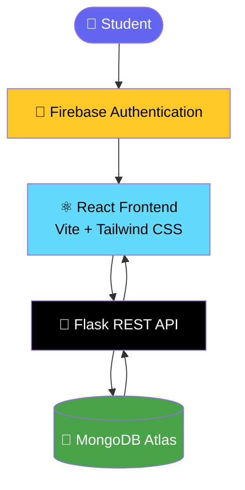
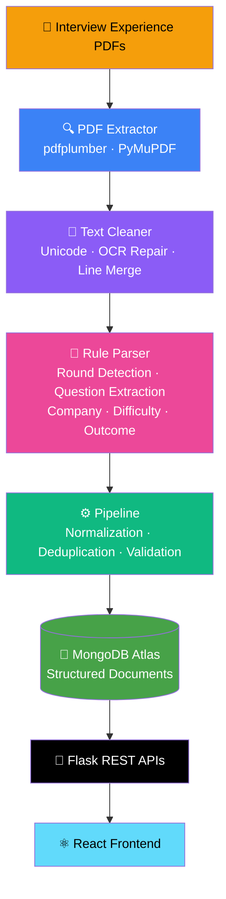
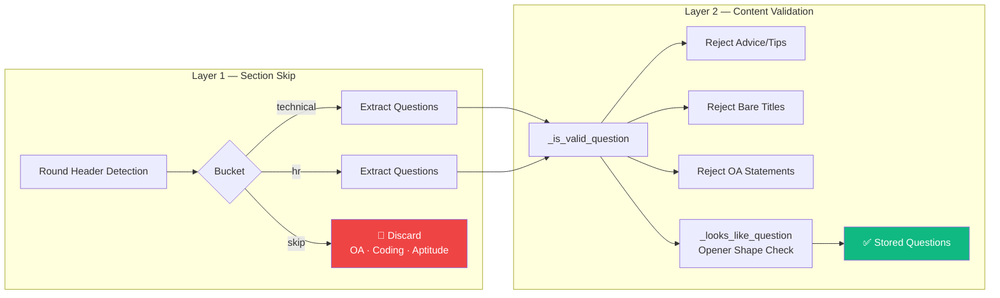

<div align="center">

# 🏛️ CareerVault

### *Real Interview Experiences. Real Preparation. Real Results.*

> A full-stack platform that transforms raw interview experience PDFs into a searchable, structured knowledge base — so every student can prepare smarter, not harder.

<br/>


<br/>

[](https://reactjs.org/)
[](https://vitejs.dev/)
[](https://flask.palletsprojects.com/)
[](https://www.mongodb.com/)
[](https://firebase.google.com/)
[](https://python.org/)
[](https://tailwindcss.com/)
[](LICENSE)

<br/>

[](/)
[](/)
[](/)
[](/)

</div>

---

## 📖 What is CareerVault?

Most students prepare for interviews using generic resources — LeetCode lists, YouTube videos, and secondhand tips. CareerVault fixes this.

CareerVault collects real interview experience PDFs shared by students after their placements and internships, extracts structured data from them using a custom NLP pipeline, and presents everything through a clean, searchable interface. Students can see exactly what rounds a company runs, what technical questions were asked, what the HR discussion looked like, how difficult it was, and whether the candidate was selected — all from real, named company experiences.

---

## ✨ Features

### 🔐 Authentication
- Firebase-powered login and logout
- Protected routes and user dashboard
- Personalized welcome experience

### 📊 Dashboard
- Live statistics: total companies, experiences, questions, and rounds
- At-a-glance overview of the entire knowledge base

### 🏢 Companies
- Browse and search all companies in the database
- Individual company detail pages with statistics
- Filter experiences by company

### 📋 Interview Experiences
- Full breakdown of every interview: Technical, HR, Coding, and OA rounds
- Per-round questions, difficulty rating, and outcome
- Preparation tips extracted from real experiences

### 🔍 Search
- Search questions across all companies and rounds
- Search companies by name

### 📤 Contribute
- Students can submit new interview experiences directly from the platform
- Moderated pipeline processes and stores submissions

### ⚙️ Backend & Data Pipeline
- REST API with full CRUD support
- Automated PDF processing: extract → parse → clean → store
- Structured MongoDB documents for every experience

---

## 🛠️ Tech Stack

### Frontend

| Technology | Purpose | Version |
|---|---|---|
| [React](https://reactjs.org/) | UI Framework | 18 |
| [Vite](https://vitejs.dev/) | Build Tool & Dev Server | 5 |
| [Tailwind CSS](https://tailwindcss.com/) | Styling | 3 |
| [React Router](https://reactrouter.com/) | Client-side Routing | 6 |
| [Axios](https://axios-http.com/) | HTTP Client | 1 |
| [Lucide React](https://lucide.dev/) | Icon Library | Latest |

### Backend

| Technology | Purpose | Version |
|---|---|---|
| [Python](https://python.org/) | Backend Language | 3.11 |
| [Flask](https://flask.palletsprojects.com/) | Web Framework | 3 |
| [MongoEngine](http://mongoengine.org/) | MongoDB ODM | Latest |
| [pdfplumber](https://github.com/jsvine/pdfplumber) | PDF Extraction | Latest |
| [PyMuPDF](https://pymupdf.readthedocs.io/) | PDF Fallback | Latest |
| [wordninja](https://github.com/keredson/wordninja) | OCR Word Segmentation | Latest |

### Infrastructure

| Technology | Purpose |
|---|---|
| [MongoDB Atlas](https://www.mongodb.com/atlas) | Database |
| [Firebase Auth](https://firebase.google.com/products/auth) | Authentication |
| [Vercel](https://vercel.com/) | Frontend Deployment |
| [Render](https://render.com/) | Backend Deployment |

---

## 🏗️ Architecture

### Application Flow



### PDF Processing Pipeline



### Parser Architecture

The rule-based NLP parser operates in two layers:



---

## 📸 Screenshots

| Screen | Preview |
|---|---|
| 🔐 Login |  |
| 📊 Dashboard |  |
| 🏢 Companies |  |
| 📋 Company Detail |  |
| 🔍 Question Search |  |
| 📤 Contribute |  |

> Replace placeholders with actual screenshots once deployed.

---

## 📁 Project Structure

```
CareerVault/
│
├── backend/
│   ├── api/                        # Route blueprints
│   │   ├── companies.py
│   │   ├── experiences.py
│   │   ├── questions.py
│   │   ├── stats.py
│   │   └── contribute.py
│   ├── models/
│   │   └── interview.py            # MongoEngine document models
│   ├── services/
│   │   ├── pdf_extractor.py        # pdfplumber + PyMuPDF extraction
│   │   ├── rule_parser.py          # Custom NLP parser
│   │   ├── pipeline.py             # End-to-end ingestion pipeline
│   │   └── company_normalizer.py   # Canonical company name mapping
│   ├── scripts/
│   │   └── reprocess_from_pdfs.py  # Batch reprocessing script
│   ├── uploads/                    # PDF storage
│   ├── app.py                      # Flask app entry point
│   └── requirements.txt
│
├── frontend/
│   ├── src/
│   │   ├── components/             # Reusable UI components
│   │   ├── pages/                  # Route-level page components
│   │   ├── context/                # React context (Auth, etc.)
│   │   ├── api/                    # Axios API service layer
│   │   └── assets/                 # Static assets
│   ├── index.html
│   ├── vite.config.js
│   ├── tailwind.config.js
│   └── package.json
│
└── README.md
```

---

## 🚀 Installation & Setup

### Prerequisites

- Node.js 18+
- Python 3.11+
- MongoDB Atlas account
- Firebase project

### 1. Clone the repository

```bash
git clone https://github.com/your-username/CareerVault.git
cd CareerVault
```

### 2. Backend Setup

```bash
cd backend

# Create and activate virtual environment
python -m venv venv
source venv/bin/activate        # macOS/Linux
venv\Scripts\activate           # Windows

# Install dependencies
pip install -r requirements.txt

# Configure environment variables
cp .env.example .env
# Fill in MONGO_URI, SECRET_KEY, FIREBASE credentials
```

```bash
# Run the Flask server
python app.py
```

Backend runs at `http://localhost:5000`

### 3. Frontend Setup

```bash
cd frontend

# Install dependencies
npm install

# Configure environment variables
cp .env.example .env
# Fill in VITE_API_BASE_URL and Firebase config keys
```

```bash
# Start the development server
npm run dev
```

Frontend runs at `http://localhost:5173`

---

## 📡 API Endpoints

### Statistics

| Method | Endpoint | Description |
|---|---|---|
| `GET` | `/api/v1/stats` | Platform-wide statistics |

### Companies

| Method | Endpoint | Description |
|---|---|---|
| `GET` | `/api/v1/companies` | List all companies |
| `GET` | `/api/v1/companies/:name` | Company detail with rounds and questions |

### Questions

| Method | Endpoint | Description |
|---|---|---|
| `GET` | `/api/v1/questions/search?q=` | Search questions across all experiences |

### Contributions

| Method | Endpoint | Description |
|---|---|---|
| `POST` | `/api/v1/contribute` | Submit a new interview experience |
| `DELETE` | `/api/v1/contribute/:id` | Delete an experience (admin) |

### Example Response — `/api/v1/companies/:name`

```json
{
  "company": "Deutsche Bank",
  "total_experiences": 18,
  "experiences": [
    {
      "id": "64f3a...",
      "role": "Software Engineer",
      "year": "2024",
      "difficulty": "medium",
      "outcome": "selected",
      "rounds": [
        {
          "round_type": "technical",
          "questions": [
            "What is virtual memory?",
            "Explain the pillars of OOP.",
            "Difference between Java and C++."
          ]
        },
        {
          "round_type": "hr",
          "questions": [
            "Tell me about yourself.",
            "Why Deutsche Bank?"
          ]
        }
      ]
    }
  ]
}
```

---

## 📊 Project Statistics

<div align="center">

| Metric | Count |
|---|:---:|
| 📄 PDFs Processed | **120+** |
| 🏢 Companies | **25+** |
| 🔄 Interview Rounds | **314+** |
| ❓ Interview Questions | **774+** |

</div>

---

## 🔮 Future Improvements

| Feature | Description |
|---|---|
| 🤖 AI Interview Assistant | Ask questions about any company using RAG over stored experiences |
| 📄 AI Resume Analyzer | Upload resume → get gap analysis against target company skills |
| 📈 Company Analytics | Trends, selection rates, most-asked topics per company |
| 🔖 Bookmarks | Save questions and experiences for later review |
| 🎯 Mock Interview Generator | Auto-generate mock Q&A sets from real company data |
| 📅 Interview Timeline | Visual round-by-round timeline for each experience |
| ⚖️ Company Comparison | Side-by-side comparison of interview processes across companies |
| 🔥 Most Asked Questions | Per-company and global trending question lists |

---

## 🤝 Contributing

Contributions are welcome. To contribute:

1. Fork the repository
2. Create a feature branch: `git checkout -b feature/your-feature-name`
3. Commit your changes: `git commit -m 'Add your feature'`
4. Push to the branch: `git push origin feature/your-feature-name`
5. Open a Pull Request

Please make sure your code follows existing conventions and all functions are documented.

---

## 👥 Contributors

<table>
  <tr>
    <td align="center">
      <a href="https://github.com/your-username">
        <br/>
        <sub><b>Your Name</b></sub>
      </a>
    </td>
    <td align="center">
      <a href="https://github.com/contributor-2">
        <br/>
        <sub><b>Contributor 2</b></sub>
      </a>
    </td>
    <td align="center">
      <a href="https://github.com/contributor-3">
        <br/>
        <sub><b>Contributor 3</b></sub>
      </a>
    </td>
  </tr>
</table>

---

## 📄 License

This project is licensed under the [MIT License](LICENSE).

```
MIT License

Copyright (c) 2024 CareerVault Contributors

Permission is hereby granted, free of charge, to any person obtaining a copy
of this software and associated documentation files (the "Software"), to deal
in the Software without restriction, including without limitation the rights
to use, copy, modify, merge, publish, distribute, sublicense, and/or sell
copies of the Software.
```

---

<div align="center">

**Built with ❤️ for students, by students.**

⭐ If CareerVault helped you prepare for your interview, give it a star!

[](https://github.com/your-username/CareerVault)

</div>
