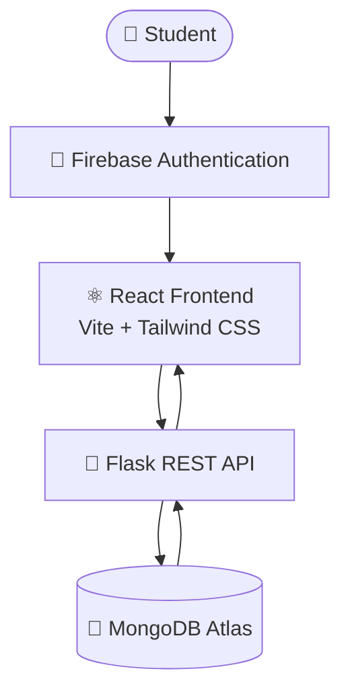
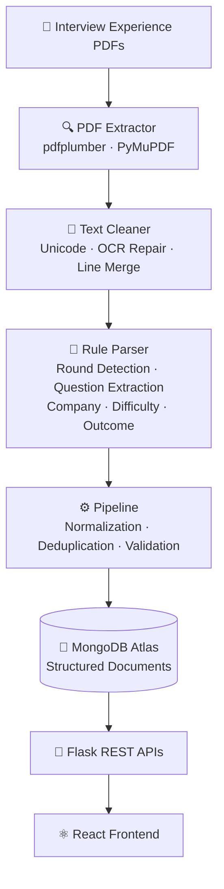
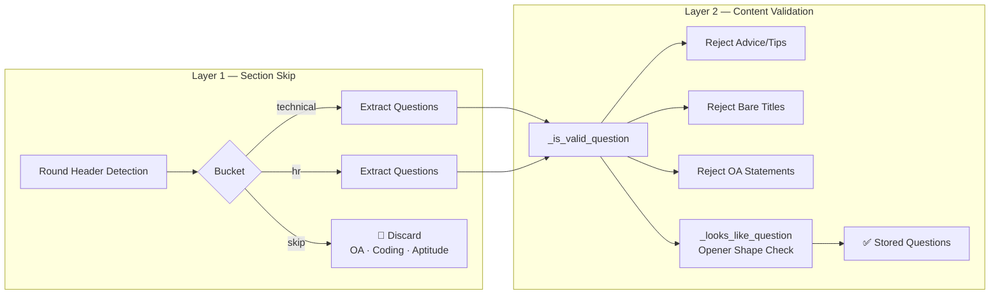

# CareerVault Architecture

## Overview

CareerVault is a full-stack application that transforms raw interview experience PDFs into structured, searchable data. It consists of a PDF ingestion pipeline, a MongoDB Atlas database, a Flask REST API, and a React frontend, with Firebase handling authentication.

---

## Application Flow

---

## PDF Processing Pipeline

---

## Parser Architecture

The rule-based parser operates in two layers:

**Layer 1 — Section Skip:** Detects round headers in the extracted text and buckets content into `technical`, `hr`, or `skip` (OA/Coding/Aptitude sections are discarded from question extraction at this stage).

**Layer 2 — Content Validation:** Runs candidate question lines through validation functions:
- `_is_valid_question` — rejects advice/tips text, bare section titles, and OA-related statements that aren't actual questions.
- `_looks_like_question` — checks the "opener shape" of a line (e.g., question-like phrasing) before accepting it as a stored question.

---

## System Components

### 1. Data Ingestion & Parsing Pipeline

**Location:** `backend/services/`

| File | Responsibility |
|------|-----------------|
| `pdf_extractor.py` | Extracts raw text from PDFs using pdfplumber, with PyMuPDF as a fallback extractor |
| `rule_parser.py` | Custom NLP rule-based parser — detects rounds, extracts/validates questions, identifies difficulty and outcome |
| `pipeline.py` | End-to-end ingestion pipeline — normalization, deduplication, validation, and storage orchestration |
| `company_normalizer.py` | Maps raw/variant company names to a canonical company name |

**Supporting script:** `backend/scripts/reprocess_from_pdfs.py` — batch reprocessing of previously uploaded PDFs.

**Text cleaning** handles Unicode normalization, OCR artifact repair, and line merging (word segmentation aided by `wordninja`) before parsing.

---

### 2. Database Layer

**Technology:** MongoDB Atlas
**ORM:** MongoEngine
**Model location:** `backend/models/interview.py`

**Current Data Volume:**
| Entity | Count |
|--------|-------|
| Companies | 25+ |
| Interview Experiences (PDFs processed) | 120+ |
| Interview Rounds | 314+ |
| Questions | 774+ |

(See `DATABASE_SCHEMA.md` for full schema detail.)

---

### 3. Backend (API Layer)

**Technology:** Python 3.11, Flask 3, MongoEngine

**Route blueprints (`backend/api/`):**
| File | Responsibility |
|------|-----------------|
| `companies.py` | Company listing and detail endpoints |
| `experiences.py` | Interview experience endpoints |
| `questions.py` | Question search endpoint |
| `stats.py` | Dashboard statistics endpoint |
| `contribute.py` | Submission and deletion endpoints |

**Entry point:** `backend/app.py`

(See `API_DOCUMENTATION.md` for endpoint details.)

---

### 4. Frontend (Presentation Layer)

**Technology:** React 18, Vite 5, Tailwind CSS 3, React Router 6, Axios, Lucide React

**Structure (`frontend/src/`):**
- `components/` — Reusable UI components
- `pages/` — Route-level page components (Dashboard, Companies, Company Detail, Search, Contribute, etc.)
- `context/` — React Context (e.g., Auth state)
- `api/` — Axios API service layer
- `assets/` — Static assets

---

### 5. Authentication Layer

**Technology:** Firebase Authentication

**Responsibilities:**
- Login/logout
- Session management
- Protected route gating in the frontend
- TODO: confirm backend-side Firebase token verification approach

---

## Infrastructure / Deployment Targets

| Layer | Service |
|-------|---------|
| Database | MongoDB Atlas |
| Frontend Hosting | Vercel |
| Backend Hosting | Render |
| Authentication | Firebase Auth |

(See `DEPLOYMENT_GUIDE.md` for deployment steps.)

---

## Data Flow Summary

1. Interview experience PDFs are uploaded to `backend/uploads/`.
2. `pdf_extractor.py` extracts raw text (pdfplumber primary, PyMuPDF fallback).
3. Text is cleaned (Unicode normalization, OCR repair, line merging).
4. `rule_parser.py` applies the two-layer parsing logic to detect rounds and extract valid questions, along with difficulty/outcome.
5. `pipeline.py` normalizes, deduplicates, and validates parsed data, using `company_normalizer.py` to resolve canonical company names.
6. Structured documents are stored in MongoDB Atlas via MongoEngine models.
7. Flask REST APIs (`backend/api/`) serve this data as JSON.
8. The React frontend consumes these APIs via Axios and renders the Dashboard, Companies, Company Detail, Search, and Contribute experiences.

---

## Status

This architecture reflects the current project state (~90–92% complete). Remaining work includes parser refinement and production deployment.